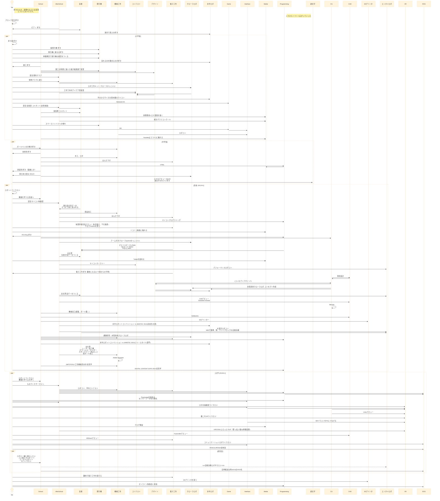

# my interest

```mermaid
%%{init:{'theme':'base'}}%%
sequenceDiagram
%%{config:{'messageAlign':'left'}}%%
    actor me as Me
    participant sch as School
    participant afs as AfterSchool
    participant mus as 音楽
    participant pla as 飛行機
    participant mec as 機械工作
    participant con as コンテスト
    participant des as デザイン 
    participant ele as 電子工作
    participant cra as クローラロボ
    participant wat as 水中ロボ
    participant gam as Game
    participant gcn as Interface
    participant med as Media
    participant pro as Programming
    participant emo as 顔文字
    participant cg as CG
    participant cad as CAD
    participant 3dp as 3Dプリンタ
    participant ent as エンタメロボ
    participant vr as VR
    participant ros as ROS
    Note right of me : 好きなもの、影響を与えた出来事<br>についてのメモです。
    Note right of pro : メカからソフトへ広がっていった

    me ->> me : ブロック遊び好き
    afs ->>+ me : ピアノ 好き
    afs ->>+ mus: 
    me ->> wat : 湯舟で遊ぶの好き
    
    par 小学校
        me ->> me : 折り紙 好き
        me ->> pla : 紙飛行機 好き
        me ->> pla : 飛行機に乗るの好き
        me ->> pla : 体験教室で飛行機の模型をつくる
        me ->> wat : 流れる水を眺めるのが好き
        sch ->> me : 図工 好き
        sch ->> pla : 図工の時間に描いた絵が絵画展で受賞
        sch ->>+ con: 
        sch ->>+ des: 
        me ->> afs : 部活 理科クラブ
        me ->> afs : 発明クラブに通う
        afs ->>+ mec: 
        afs ->>+ ele: 
        me ->>+ cra : ロボ工作キット クローラかっこいい
        me ->> con : 工作で市村アイデア賞受賞
        afs ->> con: 
        cra ->> con: 
        des ->> con: 
        me ->>+ wat : 手のひらサイズの潜水艦のラジコン
        me ->> gam : Nintendo DS
        me ->> afs : 部活 音楽部 コルネット(金管楽器)
        afs ->> mus: 
        sch ->> mus : 鼓笛隊 コルネット
        sch ->> med : 新聞委員:4コマ漫画を描く
        afs ->> med : 統計グラフコンクール
        me ->> pla : スペースシャトルへの憧れ
        me ->> gam : Wii
        gam ->> gcn: 
        mec ->> gcn : ロボコン
        sch ->> med : Youtube(ようつべ)に触れる
    end

    par 中学校
        me ->> sch : ボールペンの分解が好き
        me ->> mec: 
        sch ->> me : 技術科 好き
        sch ->> mec : 木工、ロボ
        sch ->> ele : はんだづけ
        sch ->>+ pro : HTML
        pro ->> med: 
        sch ->> me : 家庭科 好き（裁縫とか）
        sch ->> me : 東日本大震災 2011/3
        sch ->> cra: 
        me ->>+ emo : スマホデビュー2012/3<br>顔文字かわいい 好き
    end
    par 高校 (2012/4-)
        me ->> me : ロボットつくりたい
        me ->> sch : 機械を学べる高校へ
        me ->> afs : 部活:マイコン制御部
        mus ->> afs : 展示品の音ゲーの<br>ピコピコ音に惹かれる
        afs ->> mec : 部品加工
        afs ->> ele : はんだづけ
        afs ->> pro : マイコンプログラミング
        me ->> ele : 秋葉原電気街デビュー 秋月電子、千石電商...<br>千石でArduinoを買う
        me ->> med : ニコニコ動画に触れる
        sch ->> me : POV-Ray 好き
        sch ->> pro: 
        sch ->>+ cg: 
        afs ->> cra : アーム付きクローラ(quinceかっこいい)
        ele ->> mus : ピエゾスピーカ+PWM<br>SDカードでWAV<br>PCからMIDI...
        pro ->> mus: 
        afs ->> mus : 文化祭<br>先輩が音ゲーをつくる
        me ->> med : Twitterを始める
        afs ->> con : マイコンカーラリー
        afs ->>+ ent : パフォーマンスロボコン
        ele ->> me : 電子工作 好き 趣味になる(いつ頃からか不明)
        cg ->> cad : 簡易設計
        cad ->> cg: 
        des ->> cg : (コンセプトデザイン?)
        cg ->> des: 
        cg ->> cra : 水陸両用クローラロボ コンセプト作成
        cg ->> wat: 
        des ->> cra: 
        des ->> wat: 
        afs ->> mus : 文化祭:音ゲーをつくる
        afs ->> ent: 
        afs ->>+ cad : CADデビュー<br>Autodesk Inventor
        cg ->> cg : Blender
        sch ->> mec : 機械加工(旋盤、ボール盤...)
        sch ->> cad : Solidworks
        sch ->>+ 3dp : 3Dプリンター
        afs ->> wat : 水中ロボットコンベンション in JAMSTEC 2013(高校生の部)
        afs ->> ent : 大道芸ロボコン<br>MIDIで鉄琴、鈴、ウッドブロックの自動演奏
        mus ->> ent: 
        sch ->> cra : 課題研究 : 水陸両用クローラロボ
        sch ->> mec: 
        sch ->> ele: 
        sch ->> pro: 
        sch ->> wat : 水中ロボットコンベンション in JAMSTEC 2014(フリースタイル部門)
        afs ->> mec : 文化祭<br>レーザー加工機<br>(アクリルキーホルダー<br>スタンプラリー用はんこ)<br>段ボール加工
        mec ->> mec : Adobe Illustrator
        sch ->> mec : JIMTOF2014 工作機械見本市 初見学
        me ->> pro : DIGITAL CONTENT EXPO 2014 初見学
    end
    par 大学 (2015/4-)
        me ->> sch : ロボットつくりたい<br>機械を学べる大学へ
        me ->> afs : ものづくりサークルへ
        afs ->> mec : ロボコン、学内コンテスト
        afs ->> ele: 
        afs ->> gcn: 
        afs ->> pro: 
        afs ->>+ ros: 
        pro ->> ros: 
        me ->> pro : Processingを始める<br>センサーデータの可視化
        me ->> gcn: 
        me ->> afs: 
        me ->>+ vr : ロボの操縦席つくりたい
        me ->> gcn: 
        gcn ->> vr: 
        cg ->> vr: 
        cg ->> vr : Unityデビュー
        me ->> vr : 艦これVRつくりたい
        gcn ->> vr : WiiリモコンをPCにつなげる
        me ->> med : ブログ開設
        afs ->> vr : IVRC2016 ふらっとFLAT（酔っ払い疑似体験装置)
        me ->> cad : Fusion360デビュー
        me ->> ele : M5Stackデビュー
        me ->> ros : コミュニケーションロボつくりたい
        me ->> gcn: 
        me ->> ros : ROSConJP2018 初参加

        par 研究室
            me ->> sch : ロボと一緒に暮らしたい<br>人と暮らすロボット/<br>エンタメロボット<br>をつくりたい

            sch -->> ent : <s>自動演奏ロボやりたい</s>
            sch ->> ros : 自律搬送台車(AGV)のROS化
        end
    end

    me ->> ele : 趣味で電子工作を続ける
    me ->> 3dp : 3Dプリンタを買う
    me ->> pro : オンライン勉強会に参加
    me ->> ros: 
```
